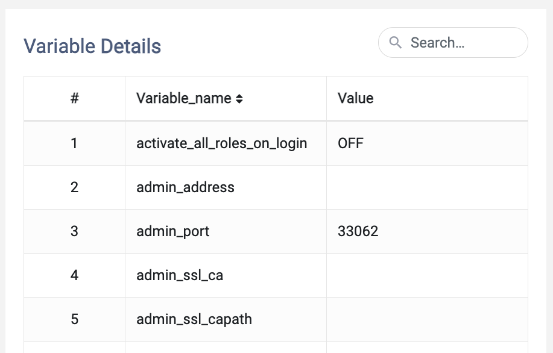
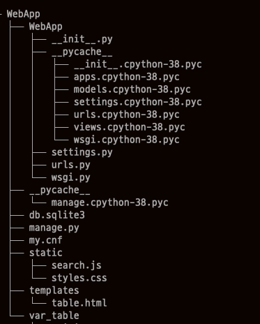
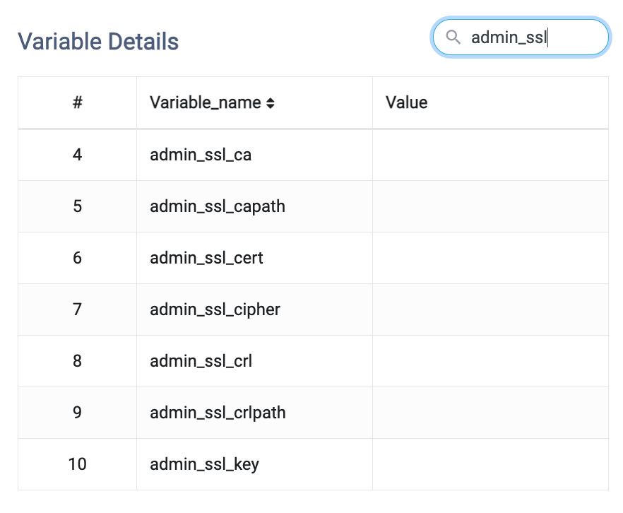
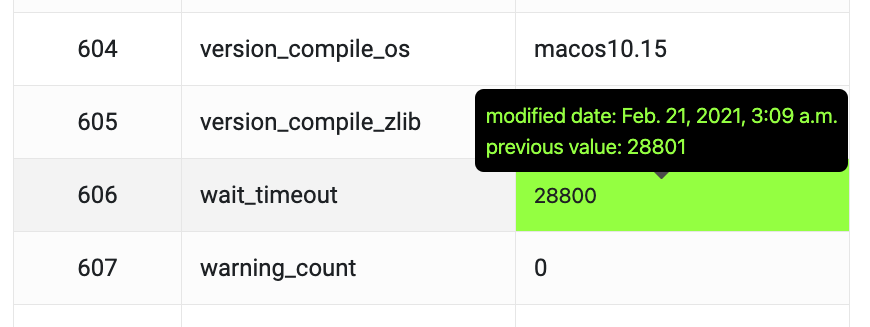

# Monitoring MySQL variables

Web application which displays MySQL variables and its current values.

<p align="center">
  
</p>


## Running app

1. `cd` into `WebApp` directory

<p align="center">
  
</p>

2. make `my.cnf` file and write informations below. `NAME` should be the name of the database in your MySQL server. `USER` should probably be `root`, and `PASSWORD` should be the password for the `USER`.

```
[client]
database = SendBird
user = root
password = ...
default-character-set = utf8
```

3. type `python mange.py runserver`
4. The page will be hosted on `http://127.0.0.1:8000/`
5. press `ctrl+c` twice to end process


## Implemeted features

### Refresh

The table refreshes automatically every minute (might be slightly longer than a minute). `refresing variable information...` and `finished refreshing` will sho w up in the terminal when refreshing variables. Press F5 (reload page) to see updated results. 

### Search box

<p align="center">
  
</p>

Finds variabls that contains typed substring.


### Change log

<p align="center">
  
</p>

The box that contains the value of recently changed variable will turn green. If you hover your mouse over the value a tooltip with modified date and previous value will show up.


## Extra information

Implemented refreshing of the variables using `schedule` package in python.

You should install the package to run this app. 